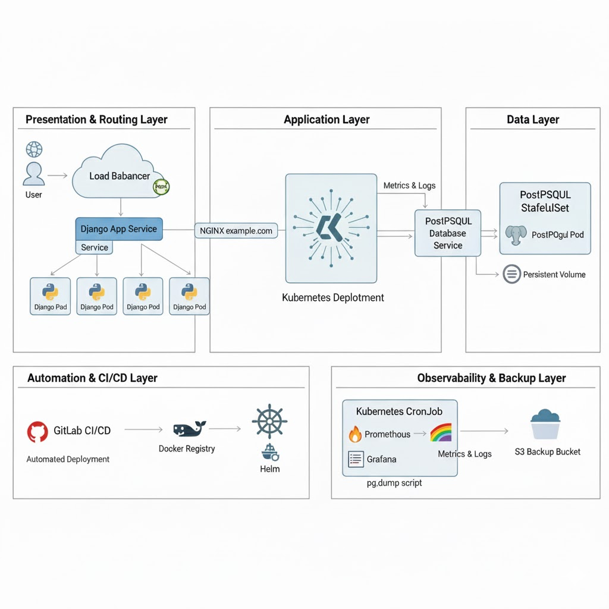

# CryptoCurrency-exchange

## Proposal: Minimalist Kubernetes Deployment
This proposal outlines a fast, scalable, and automated infrastructure for the CryptoCurrencyExchange web application. The design prioritizes industry-standard tools for a minimal, robust setup that can be deployed in 1-2 days.

# Schematic Design

The architecture is designed for simplicity and scalability within a Kubernetes environment.



---

## Traffic Flow
User requests hit a **Load Balancer**, which is managed by an **NGINX Ingress Controller**.  
The Ingress routes traffic to the appropriate **Django App Service**, which in turn distributes it among the stateless **Django Pods**.

---

## Application Backend
The **Django application** runs as a **Kubernetes Deployment**, allowing for easy scaling and rolling updates.

---

## Database
**PostgreSQL** is deployed as a **StatefulSet** to ensure stable network identity and persistent storage.  
For this minimal setup, a single **Primary instance** is used.  
A **Read Replica** can be easily added later for scalability.

---

## Automation
**GitHub Actions** watches the main branch.  
On a push, it builds a new Docker image, pushes it to a container registry, and uses **Helm** to deploy the new version to the cluster automatically.

---

## Observability
**Prometheus** scrapes metrics from the application and cluster, which are visualized in **Grafana**.  
**Loki** aggregates logs from all pods, which can also be queried and viewed in Grafana.

---

## Backup
A **Kubernetes CronJob** runs a daily script to perform a `pg_dump` of the database and upload it to an **S3-compatible object store**.


## Selected Solutions

| **Component**        | **Selected Solution**                | **Justification**                                                                                                                                                             |
|-----------------------|--------------------------------------|--------------------------------------------------------------------------------------------------------------------------------------------------------------------------------|
| CI/CD                 | GitHub Actions                      | Tightly integrated with the source code repository, easy to set up with community-supported actions, and has a generous free tier.                                             |
| Configuration          | Helm                                | The de-facto package manager for Kubernetes. It allows for templating configurations, managing releases, and simplifying complex deployments.                                 |
| Ingress               | NGINX Ingress Controller             | The most widely adopted, feature-rich, and well-documented ingress controller for Kubernetes.                                                                                 |
| Database              | PostgreSQL (Bitnami Helm Chart)      | The application requires PostgreSQL. The Bitnami chart is a trusted, secure, and well-maintained solution that simplifies setup.                                              |
| Monitoring            | Prometheus + Grafana                 | The industry standard for cloud-native monitoring. The kube-prometheus-stack Helm chart provides a comprehensive, one-command setup.                                          |
| Log Collection        | Grafana Loki                         | A lightweight, cost-effective logging solution that integrates seamlessly with Prometheus and Grafana, providing a single pane of glass for observability.                    |
| Database Backup       | Kubernetes CronJob + pg_dump         | A simple, reliable, and Kubernetes-native way to schedule tasks. It requires no external services beyond object storage for the backup files.                                 |

## Git Repository Files

```bash
.
├── .github/
│   └── workflows/
│       └── cd.yml
├── app/
│   ├── CryptoCurrencyExchange/
│   │   ├── __init__.py
│   │   ├── settings.py
│   │   ├── urls.py
│   │   └── wsgi.py
│   ├── CryptoExchange/
│   │   ├── migrations/
│   │   ├── templates/
│   │   ├── __init__.py
│   │   ├── admin.py
│   │   ├── apps.py
│   │   ├── models.py
│   │   ├── tests.py
│   │   └── views.py
│   ├── Dockerfile
│   ├── manage.py
│   └── requirements.txt
├── charts/
│   └── crypto-exchange/
│       ├── Chart.yaml
│       ├── templates/
│       │   ├── _helpers.tpl
│       │   ├── deployment.yaml
│       │   ├── ingress.yaml
│       │   ├── secrets.yaml
│       │   └── service.yaml
│       └── values.yaml
├── db-backup/
│   ├── backup.sh
│   └── cronjob.yaml
├── .gitignore
├── LICENSE
└── README.md
```


## Kubernetes Deployment for Crypto Exchange App
This repository contains the full infrastructure-as-code configuration to containerize and deploy a Django-based cryptocurrency exchange application on Kubernetes. The project uses Docker, Helm, and GitHub Actions (or GitLab CI/CD) to create a scalable, automated, and observable environment.

## Core Technologies

* **Orchestration:** Kubernetes (Minikube for local development)
* **Containerization:** Docker
* **CI/CD:** GitHub Actions (or GitLab CI/CD)
* **Configuration Management:** Helm
* **Database:** PostgreSQL
* **Monitoring:** Prometheus & Grafana
* **Logging:** Grafana Loki
* **Ingress:** NGINX Ingress Controller

## Architecture Overview
The architecture is designed for a cloud-native environment:

* **Application Layer:** The stateless Django application runs as a Kubernetes Deployment, allowing for easy scaling and zero-downtime updates.

* **Data Layer:** PostgreSQL is deployed as a StatefulSet to ensure stable, persistent storage.

* **DRouting:** An NGINX Ingress Controller manages external traffic, routing it to the appropriate application service.

* **DObservability:** Prometheus scrapes metrics and Loki aggregates logs, with Grafana providing a unified dashboard for visualization.

* **DAutomation:** The CI/CD pipeline automatically builds a new Docker image on every push to the main branch and deploys it to the cluster using Helm.


## File Contents
.github/workflows/cd.yml
.gitlabci
app/Dockerfile
charts/crypto-exchange/Chart.yaml
charts/crypto-exchange/values.yaml
charts/crypto-exchange/templates/deployment.yaml
charts/crypto-exchange/templates/ingress.yaml
charts/crypto-exchange/templates/secrets.yaml
charts/crypto-exchange/templates/service.yaml
db-backup/backup.sh
db-backup/cronjob.yaml
db-backup/job.yaml


# 3. Implementation Instructions & Architecture Explanation

This guide explains how to deploy the architecture described above.

---

## Prerequisites

Before proceeding, ensure you have the following tools and resources available:

- **kubectl** installed  
- **Helm** installed  
- A **Kubernetes cluster** (e.g., Minikube for local development, or a cloud provider like GKE, EKS, or AKS)  
- A **Docker Hub account** (or other container registry)  
- A **GitHub repository** containing the necessary configuration and deployment files  
- *(Optional, for Backup)* An **S3-compatible object storage bucket** and corresponding **access credentials**

## Step-by-Step Deployment
1. Install Cluster Prerequisites (One-time setup)

```bash
# Install NGINX Ingress Controller
helm repo add ingress-nginx https://kubernetes.github.io/ingress-nginx
helm install ingress-nginx ingress-nginx/ingress-nginx --namespace ingress-nginx --create-namespace

# Install PostgreSQL (using the Bitnami chart)
helm repo add bitnami https://charts.bitnami.com/bitnami
helm install postgresql bitnami/postgresql --set auth.postgresPassword=SUPER_SECRET_PASSWORD --set auth.database=crypto_db --set auth.username=crypto_user

# Install Prometheus and Grafana Monitoring Stack
helm repo add prometheus-community https://prometheus-community.github.io/helm-charts
helm install prometheus prometheus-community/kube-prometheus-stack --namespace monitoring --create-namespace

# Install Loki for logging
helm repo add grafana https://grafana.github.io/helm-charts
helm install loki grafana/loki-stack --namespace logging --create-namespace
```

# 2. Configure GitHub Secrets

In your GitHub repository, navigate to:

**Settings → Secrets and variables → Actions**

Add the following **repository secrets**:

| **Secret Name**       | **Description**                                                                 |
|-----------------------|---------------------------------------------------------------------------------|
| `DOCKERHUB_USERNAME`  | username.                                                       |
| `DOCKERHUB_TOKEN`     | access token.                                                   |
| `KUBECONFIG`          | The base64-encoded content of the cluster's kubeconfig file.<br>Example: `cat ~/.kube/config | base64 -w 0` |
| `DJANGO_SECRET_KEY`   | A new, randomly generated secret key for Django.                                |
| `DB_PASSWORD`         | PostgreSQL password                                 (e.g., `SUPER_SECRET_PASSWORD`). |


3. Trigger Deployment
we Make a change, commit, and push it to the main branch of your repository.
```
git push origin main
```

## GitHub Actions Workflow Overview

Once you push changes to the repository, the **GitHub Actions** workflow will automatically trigger. It performs the following steps:

1. **Build the Docker image** from `app/Dockerfile`.
2. **Push the image** to your Docker Hub repository, tagged with the commit SHA.
3. **Deploy to Kubernetes** using **Helm**, applying the `crypto-exchange` chart and injecting:
   - The new Docker image tag  
   - The required GitHub Secrets (environment variables)

4. Access the Application

we Find the external IP address of your Ingress controller.
```bash
kubectl get svc -n ingress-nginx ingress-nginx-controller
```

Add it an entry to the local /etc/hosts file to map the domain to the IP:
<EXTERNAL_IP>   crypto.example.com

Now we can now access your application at http://crypto.example.com.

5.Set up and Verify Database Backup:
First, create a secret to hold the database and S3 credentials for the backup job.

```bash
kubectl create secret generic db-backup-secrets \
--from-literal=POSTGRES_USER=crypto_user \
--from-literal=POSTGRES_PASSWORD=SUPER_SECRET_PASSWORD \
--from-literal=POSTGRES_HOST=postgresql \
--from-literal=POSTGRES_DB=crypto_db \
--from-literal=S3_BUCKET_NAME=your-s3-backup-bucket \
--from-literal=AWS_ACCESS_KEY_ID=YOUR_AWS_KEY_ID \
--from-literal=AWS_SECRET_ACCESS_KEY=YOUR_AWS_SECRET_KEY
```
Then, we apply the CronJob manifest:    
```bash
kubectl apply -f db-backup/cronjob.yaml
```

6.Access Monitoring Dashboards:
To access Grafana, port-forward the service:

```bash
kubectl port-forward svc/prometheus-grafana 8080:80 -n monitoring
```

Navigate to http://localhost:8080. Log in with the default credentials (admin/prom-operator). You can now explore pre-built dashboards for Kubernetes and add Loki as a data source to query your application logs.


This project uses a modern, cloud-native architecture designed for scalability, automation, and resilience on Kubernetes.

At its core, the architecture separates concerns into distinct, containerized layers that work together. A user's request flows through a routing layer, is processed by the application, which then communicates with a persistent data store. The entire lifecycle is automated and observable.


# Architectural Layers

Here is a breakdown of the key components of the system's architecture.

---

## 1. Presentation & Routing Layer 🚦

This layer is the entry point for all user traffic.

- **Load Balancer**:  
  An external cloud load balancer receives incoming HTTPS traffic from the internet.  
  Its primary job is to forward this traffic into the Kubernetes cluster.

- **NGINX Ingress Controller**:  
  Acting as a smart reverse proxy or "receptionist" inside the cluster, the Ingress Controller inspects incoming requests (e.g., `crypto.example.com`) and routes them to the correct internal service — in this case, the Django application service.

---

## 2. Application Layer 🚀

This is where your application's business logic lives.

- **Docker Containers**:  
  The Django application is packaged into a lightweight, portable Docker image.  
  This ensures it runs identically everywhere — from a developer's laptop to production.

- **Kubernetes Deployment**:  
  Kubernetes manages the application containers using a **Deployment**.  
  This object ensures a desired number of pods (copies) are running.  
  If a pod crashes, the Deployment automatically replaces it.  
  It also enables zero-downtime rolling updates.  
  The application pods are **stateless**, meaning they store no critical data, allowing them to be easily created or destroyed.

- **Kubernetes Service**:  
  A stable network endpoint (**ClusterIP Service**) is placed in front of the application pods.  
  The Ingress Controller sends traffic to this service, which then load-balances it across the available pods.

---

## 3. Data Layer 💾

This layer is responsible for persistent data storage.

- **PostgreSQL Database**:  
  The primary database for the application.

- **Kubernetes StatefulSet**:  
  Unlike the stateless application, the database must maintain its state and have a stable network identity.  
  A StatefulSet is used to manage the PostgreSQL pod, providing it with **persistent storage** through a **PersistentVolume**.  
  This ensures that even if the database pod restarts, its data remains intact.

- **Kubernetes Service**:  
  A separate service is created for the database, giving the Django application a consistent address to connect (e.g., `postgresql-service`).

---

## 4. Automation & CI/CD Layer ⚙️

This layer automates the build and deployment process.

- **GitHub Actions**:  
  This CI/CD pipeline is triggered whenever code is pushed to the main branch.  
  It automatically performs the following steps:
  1. Builds a new Docker image from the source code.  
  2. Pushes the new image to a container registry (like Docker Hub).  
  3. Deploys the updated application to Kubernetes using a Helm chart, triggering a safe, rolling update of the application pods.

---

## 5. Observability Layer 📊

This layer provides insights into the health and performance of the system.

- **Monitoring (Prometheus & Grafana)**:  
  Prometheus automatically scrapes metrics (CPU usage, memory, request latency, etc.) from all components in the cluster.  
  Grafana visualizes these metrics in powerful dashboards, providing a real-time view of the system’s health.

- **Logging (Loki)**:  
  Loki aggregates logs from every pod in the cluster into a central, queryable location.  
  It integrates directly with Grafana, allowing you to correlate metrics and logs for rapid troubleshooting.

---

## 6. Backup & Recovery Layer 🛡️

This ensures data safety and disaster recovery.

- **Kubernetes CronJob**:  
  A scheduled job that runs automatically (e.g., once a day).

- **pg_dump Script**:  
  The CronJob runs a pod containing a script that connects to the PostgreSQL database, performs a full backup using `pg_dump`, and uploads the compressed backup file to a secure, external location like an **S3 bucket**.


## how to run


# Local Development Setup 🚀

Follow these steps to run the entire stack on your local machine using **Minikube**.

---

## Prerequisites

Ensure you have the following tools installed locally:

- **Docker Engine** 
- **Git**
- **Minikube** (v1.25.0 or later)


## 1.Install Minikube
Minikube is typically installed as a standalone binary.

```bash
# Download the latest Minikube binary
curl -LO https://storage.googleapis.com/minikube/releases/latest/minikube-linux-amd64

# Install it to your user's local bin path
sudo install minikube-linux-amd64 /usr/local/bin/minikube
```
## 2.Install kubectl
You can install kubectl, the Kubernetes command-line tool, using your system's package manager.
```bash
# Update your apt package index
sudo apt-get update

# Install packages to allow apt to use a repository over HTTPS
sudo apt-get install -y apt-transport-https ca-certificates curl

# Download the public signing key for the Kubernetes package repositories
curl -fsSL https://pkgs.k8s.io/core:/stable:/v1.28/deb/Release.key | sudo gpg --dearmor -o /etc/apt/keyrings/kubernetes-apt-keyring.gpg

# Add the appropriate Kubernetes apt repository
echo 'deb [signed-by=/etc/apt/keyrings/kubernetes-apt-keyring.gpg] https://pkgs.k8s.io/core:/stable:/v1.28/deb/ /' | sudo tee /etc/apt/sources.list.d/kubernetes.list

# Update apt package index with the new repository and install kubectl
sudo apt-get update
sudo apt-get install -y kubectl

```
## 3.Install Helm 
```bash
# Download and run the installer script
curl https://raw.githubusercontent.com/helm/helm/main/scripts/get-helm-3 | bash
```
After running these commands, you can verify each installation by running minikube version, kubectl version --client, and helm version.


## Configure Environment
First, ensure Docker Desktop is running and has at least 8 GB of memory allocated in its Settings > Resources.

Then, start your Minikube cluster and enable the required addons.
```bash
# Start Minikube with a stable Kubernetes version
minikube start --memory=8192 --cpus=4 --kubernetes-version=stable

# Enable the Ingress controller
minikube addons enable ingress
```


## Deploy Dependencies
Use Helm to install PostgreSQL and the monitoring stack into your cluster.

```bash
# Install PostgreSQL
helm repo add bitnami https://charts.bitnami.com/bitnami
helm install postgresql bitnami/postgresql \
  --set auth.postgresPassword=SUPER_SECRET_PASSWORD \
  --set auth.database=crypto_db \
  --set auth.username=crypto_user

# Install Prometheus & Grafana
helm repo add prometheus-community https://prometheus-community.github.io/helm-charts
helm install prometheus prometheus-community/kube-prometheus-stack \
  --namespace monitoring --create-namespace
```

##  Deploy the Application
Build the application's Docker image locally and deploy it.

```bash
# Point your terminal to Minikube's Docker daemon
eval $(minikube -p minikube docker-env)
```

## Clone the below project and navigate to the 'app' directory

```bash
git clone https://github.com/sharare-sadri/CryptoCurrency-exchange.git
cd CryptoCurrency-exchange
```

# Build the image from the 'app' directory
docker build -t crypto-exchange:local-dev ./app

# Deploy the application using our Helm chart
helm upgrade --install crypto-exchange ./charts/crypto-exchange \
  --set image.repository=crypto-exchange \
  --set image.tag=local-dev \
  --set image.pullPolicy=IfNotPresent \
  --set "ingress.hosts[0].host=crypto.minikube" \
  --set-string secrets.djangoSecretKey='a-very-strong-and-random-secret-key-for-local-dev' \
  --set-string secrets.dbPassword='SUPER_SECRET_PASSWORD'
  ```

##  Access the Services
Get Minikube IP: Find your cluster's IP address with minikube ip.

Update Hosts File: Add the following line to your /etc/hosts file:

```bash
<MINIKUBE_IP>   crypto.minikube
```
127.0.0.1 crypto.minikube

# Accessing the Application & Monitoring Tools 🌐

---

## Access the Application
Open your browser and navigate to:  
👉 **[http://crypto.minikube](http://crypto.minikube)**

---

## Access Grafana
Run the following command to port-forward the Grafana service:

```bash
kubectl port-forward svc/prometheus-grafana 8080:80 -n monitoring
```

Then open your browser and go to:
👉 http://localhost:8080

Default Login Credentials:

Username: admin

Password: prom-operator
